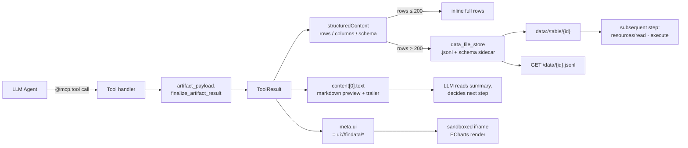

# findatamcp

> 中文版 · [English](README.en.md)

[](https://www.python.org/)
[](#license)
[](https://modelcontextprotocol.io/)
[](https://github.com/jlowin/fastmcp)

**一次调用，数据 + 图表同时到位。**

**findatamcp** 让 LLM Agent 在一次工具调用里同时拿到"给模型看的结构化数据"和"给用户看的交互式图表"。服务端覆盖 42 个金融数据工具（A 股行情、财务三表、指数基金、宏观指标），通过 MCP Apps 规范把结果渲染成可缩放的 K 线、涨跌家数仪表板、资金流折线——数据只取一次，模型不用重复调用，用户直接在 artifact 面板里操作。底层数据源为 Tushare Pro。


## 为什么选 findatamcp

LLM Agent 接金融数据，真正的瓶颈不是数据本身，而是两个反复出现的工程问题：

- **工具描述把 system prompt 撑爆** —— 42 个工具一次性铺开轻松吃掉几千 token，近似工具还互相干扰，LLM 越选越错。findatamcp 用**渐进披露**把默认可见工具数量压到 3–8 个（`get_tool_manifest` 看目录 → `focus_category` 过滤 → `show_all_tools` 展开）。
- **一次工具返回就把 context 塞满** —— 2000 行日线按 JSON 输出 30k+ token，一步之后对话就崩。findatamcp 走**200 行阈值分流**：超过阈值只回 `preview + summary + resource_uri`，完整数据落在 `.jsonl` artifact 里按需拉取。
- **数据要给模型看，也要给用户看** —— 同一份 `structuredContent` 通过 MCP Apps 规范同步送到沙箱 iframe，渲染成可缩放的 K 线 / 仪表板 / 资金流；LLM 只看 markdown 预览和引导文案，不会因"看不到图"而重复调用。
- **生产细节已就位** —— 零 CDN 依赖（ECharts 本地内联）、三层缓存、异步 Tushare 调用、PM2 守护、artifact HTTP 下载路由、实体模糊搜索（pypinyin + 别名），不是 demo 级别的拼装。

## 预览

工具调用的结构化结果会通过 MCP Apps 规范（SEP-1865，protocol `2025-06-18`）回传 `ui://` 资源，客户端在沙箱 iframe 中渲染为交互组件；LLM 则通过 `content[0].text` 看到同一数据的 markdown 表格摘要，避免重复调用。

<p align="center">
  <br>
  <sub><code>get_market_overview</code> — 全市场一页纸：涨跌家数、均值、PE/PB 中位数、环形占比</sub>
</p>

<p align="center">
  <br>
  <sub><code>get_historical_data(ts_code="000300.SH", include_ui=True)</code> — 日 K + 双均线 + 成交量，可缩放拖动</sub>
</p>

## 快速开始

```bash
# Python 3.10+
conda create -n findatamcp python=3.12
conda activate findatamcp

pip install -r requirements.txt
cp .env.example .env
# 编辑 .env，填入 TUSHARE_TOKEN

# 运行（四选一）
python -m findatamcp.server              # Streamable HTTP，推荐
python -m findatamcp.server_sse          # SSE，配合 Claude Desktop 等
./start.sh                               # PM2 守护
docker compose up -d                     # Docker 部署（见下文）
```

### Docker

```bash
export TUSHARE_TOKEN=your_token
docker compose up -d
# 端点：http://127.0.0.1:8006
# 日志：docker logs -f findatamcp
# artifact 文件持久化在命名卷 findatamcp-data（挂载到容器内 /data）
```

默认走 Streamable HTTP。需要 SSE 时在 `docker-compose.yml` 里打开 `command: ["python", "-m", "findatamcp.server_sse"]` 注释行。镜像仅基于 `python:3.12-slim`，构建产物约 400 MB 左右。

> ⚠️ `Dockerfile` 和 `docker-compose.yml` 已提供但**未经完整 CI 验证**，首次使用请自行 `docker compose build` + `docker compose up` 跑通后再投生产。

### PM2 环境变量

| 变量 | 默认值 | 说明 |
| :--- | :--- | :--- |
| `FINDATA_PYTHON` | `~/miniforge3/envs/mcp_server/bin/python` | Python 解释器路径 |
| `FINDATA_MCP_DIR` | `pm2.config.js` 所在目录 | 仓库根 |
| `FINDATA_LOG_DIR` | `~/.mcp-logs` | 日志目录 |
| `FINDATA_DATA_DIR` | `/tmp/findatamcp_data` | 大数据 artifact 落盘目录 |
| `MCP_SERVER_HOST` | `127.0.0.1` | 绑定地址 |
| `MCP_SERVER_PORT` | `8006` | 端口 |
| `SERVER_BASE_URL` | `http://127.0.0.1:8006` | artifact 外链基址 |

## 客户端接入

### Claude Desktop（SSE）

`~/Library/Application Support/Claude/claude_desktop_config.json`（macOS）或 `%APPDATA%\Claude\claude_desktop_config.json`（Windows）：

```json
{
  "mcpServers": {
    "findatamcp": {
      "transport": "sse",
      "url": "http://127.0.0.1:8006/sse"
    }
  }
}
```

服务端跑 `python -m findatamcp.server_sse` 或 `./start_sse.sh`，重启 Claude Desktop 后在工具面板能看到 findatamcp。首次使用建议先调 `get_tool_manifest` 看分类，再 `focus_category` 聚焦。

### Cursor / Continue.dev / VS Code MCP 插件

同样走 SSE：

```json
{
  "mcp.servers": {
    "findatamcp": {
      "url": "http://127.0.0.1:8006/sse",
      "transport": "sse"
    }
  }
}
```

### 自建 Agent（Python httpx 直连）

见 [docs/SSE_GUIDE.md](docs/SSE_GUIDE.md) 里的完整客户端示例（建连 → 取 sessionId → 调 tool）。

## 目录结构

```
findatamcp/
├── findatamcp/             # 主包
│   ├── server.py           # Streamable HTTP 入口，组装 DI 容器
│   ├── server_sse.py       # SSE 入口
│   ├── config.py           # 配置
│   ├── database.py         # SQLite 查询
│   ├── entity_store.py     # 实体索引（内存 + pypinyin）
│   ├── cache/              # tushare 响应 / 计算 / 文件 artifact
│   │   ├── tushare_cache.py
│   │   ├── calc_cache.py
│   │   └── data_file_store.py
│   ├── tools/              # MCP tools（12 模块 × 42 个 @mcp.tool）
│   ├── resources/          # MCP resources
│   │   ├── ui_apps.py      # ui:// 交互组件（HTML + 内联 ECharts）
│   │   ├── large_data.py   # data:// JSONL artifact 回读
│   │   ├── stock_data.py
│   │   └── entity_stats.py
│   ├── prompts/            # MCP prompts（stock_analysis 等）
│   ├── routes/             # 额外 HTTP 路由（数据下载）
│   └── utils/
│       ├── artifact_payload.py    # 统一 envelope 构造
│       ├── ui_hint.py             # LLM 提示文案
│       ├── tushare_api.py
│       ├── data_processing.py     # 对齐 / 停牌处理
│       ├── technical_indicators.py
│       ├── large_data_handler.py
│       ├── response.py
│       └── errors.py
├── tests/                  # pytest 测试
├── docs/                   # 文档（含截图）
├── static/                 # 前端资源（ECharts，本地打包）
├── pm2.config.js           # PM2 部署配置
├── start.sh / stop.sh      # PM2 生命周期
├── start_sse.sh            # SSE 前台启动
└── requirements.txt
```

## 工具一览

共 **42 个 MCP tool**，分 **12 个模块**：

| 模块 | 内容 |
| :--- | :--- |
| `market_data` | 实时行情、历史 K 线、日线 |
| `market_flow` | 资金流、成交明细 |
| `market_statistics` | 涨跌家数、板块统计 |
| `financial_data` | 财务三表、指标、分红 |
| `performance_data` | 业绩预告 / 快报 |
| `index_data` | 指数行情与成分股 |
| `fund_data` | 公募基金净值、持仓 |
| `sector` | 行业 / 概念板块 |
| `macro_data` | 宏观经济指标（GDP / CPI / PMI / M2 / LPR…）|
| `analysis` | 技术指标、相关性、对齐 |
| `search` | 代码 / 名称 / 拼音 / 别名检索 |
| `meta` | 元数据与能力发现 |

同时暴露 resources（`entity_stats`、`large_data`、`stock_data`、`ui_apps`）和 prompts（`stock_analysis`）。

## 典型场景

**① 桌面端 AI 投研工作台（Claude Desktop / Cursor）**
接入 SSE 端点后，直接在对话框里问："帮我拉沪深 300 过去半年日线，叠加 5/20 日均线"。工具返回同时做两件事：LLM 拿到 markdown 摘要知道"共 120 个交易日、涨幅 +3.4%、最近 20 日均线在 4520"，侧边栏 artifact 面板同步渲染可缩放的 K 线 + 双均线 + 成交量。问"哪天收盘最高"，LLM 不需要再调一次工具，已经在 summary 里看到。

**② 内部资管 / 投研系统的数据中台**
把 findatamcp 当作"AI 数据引擎"挂在公司内网，业务人员通过接入公司 Agent 问财务三表、全市场涨跌家数、板块资金流。超过 200 行的数据自动落 `.jsonl`，通过 `/data/{id}.jsonl` 下载路由直接对接下游风控 / 归因系统；`data://table/{id}` 又能让后续 Agent 步骤读取做二次计算，整链路不出内存。

**③ 宏观 / 行业 Dashboard 自动生成**
面向研究员的日报 / 周报工作流：Agent 串接 `get_macro_monthly_indicator`（GDP / CPI / PMI / M2 / LPR）+ `get_sector_flow` + `get_market_overview`，LLM 基于 summary 写市场速递，同时 `ui://findata/macro-panel` 直接渲染一张含多指标折线 + 环形占比的仪表板。前端无需额外开发。

---

## 实现路径

### 总览



### 核心假设：LLM Agent 在金融数据场景下的两种崩溃方式

整个项目是围绕两个实测的失败模式设计的：

**崩溃 ①：工具太多，LLM 选不动**
一次性把 42 个工具描述塞给模型，仅 system prompt 就占数千 token，而且近似工具互相干扰（`get_stock_data` / `get_realtime_price` / `get_historical_data` 都和行情沾边），LLM 经常选错或反复试探。

解决路径 → **渐进披露（progressive disclosure）**，实现在 `findatamcp/tools/meta.py`：
- `get_tool_manifest()` —— 返回按 9 个分类分组的工具清单，每条只有 `name + summary`，LLM 先看目录
- `focus_category("行情数据")` —— 通过 FastMCP `ctx.disable_components(match_all=True)` + `enable_components(tags=...)` 把非该分类的工具从 LLM 视野里**整体隐藏**，只保留当前分类 + 导航三个工具
- `show_all_tools()` —— 恢复全量
- 每个 `@mcp.tool(tags={"行情数据"}, ...)` 带中文分类 tag，关键模块（`market_statistics` / `macro_data`）额外在 docstring 里写"适用场景 / 不适用场景"，直接给 LLM 决策提示

默认 visibility 控制让 LLM 看到的工具数量在 3–8 个之间，真正需要 42 个并排对比时再 `show_all_tools`。

**崩溃 ②：一次工具调用把上下文塞爆**
用户问"过去 8 年沪深 300 日线看看走势"，天真实现会把 2000+ 行每行 10 列的 JSON 全塞回 `content.text`，光这一次回复就 30k+ token，后续几乎无法继续对话。

解决路径 → **数据不进上下文，指针进上下文**（`findatamcp/utils/large_data_handler.py` + `findatamcp/resources/large_data.py`）：
- 阈值 `THRESHOLD = 200 行`，超过就不再内联
- 返回 `preview（前 5 行）+ summary（date_range + 数值列 latest/min/max/mean）+ resource_uri = data://table/{id}`，LLM 看到的是十几行摘要，完整 2000 行躺在 `.jsonl` artifact 文件里
- 需要看细节时 LLM 主动 `resources/read` 这个 URI；需要算指标时调用 `execute` 读文件；前端 UI 直接通过 `stock://calc_metrics/...` / `data://` 按需下钻
- 对长时间序列（K 线等），`sample_rows` 再做一次 max 120 点的等距采样，UI 渲染压力被压到常量级

两条路径合起来，LLM 的 system prompt token（工具描述）和 message token（工具返回）**都被主动分流**，而不是寄希望于 context window 够大。

### 1. Envelope 契约：content + structuredContent + meta

每个工具最终通过 `finalize_artifact_result`（`findatamcp/utils/artifact_payload.py`）输出一个 `ToolResult`，三层分工：

| 层 | 消费方 | 内容 |
| :--- | :--- | :--- |
| `content[0].text` | LLM | header + 前 10 行 markdown 表 + 尾部引导（"已渲染 UI"/"还有多少行"/"要完整数据请设 as_file=True"）|
| `structuredContent` | UI iframe / execute 工具 | 唯一完整数据源：`row_count` / `columns=[{name,type}]` / `rows=[…]` / 可选 `date_range` / 可选 `path` / 可选 `download_urls` |
| `meta` | MCP host | `{ui: None}` 显式关闭 UI 渲染（`include_ui=False` 时），否则继承 `app=AppConfig(...)` 注册的 `ui://` |

这样 LLM 看到的永远是简短文本 + 引导，不会被大表淹没；UI 和下游脚本通过 `structuredContent.rows` 拿到完整数据；两者出自同一份 `rows`，避免副本漂移。

### 2. 四族资源 URI：UI、大数据、实体、计算副产物

除工具外，findatamcp 注册了四类 MCP resource，每一类 URI 解决一个具体的上下文问题：

| Scheme | 示例 | 作用 |
| :--- | :--- | :--- |
| `ui://findata/*` | `ui://findata/kline-chart` | HTML + 内联 ECharts，host 在沙箱 iframe 渲染成交互组件 |
| `data://table/{data_id}` | `data://table/7f3e…` | 超过 200 行的 artifact 按需回读，LLM 不必把整表带进上下文 |
| `entity://{stats,search/…,code/…,markets}` | `entity://search/贵州茅台` | 证券实体目录（代码 / 名称 / 拼音 / 别名 / 统计），毫秒响应 |
| `stock://calc_metrics/{calc_id}[/pair/{a}/{b}]` | `stock://calc_metrics/abc/pair/600519.SH/000858.SZ` | 相关性等计算的时间序列副产物和派生指标（波动率、最大回撤、夏普、月度对比）|

四族共用一个原则：**让上下文只携带"指针 + 摘要"，真正的数据体放到资源里按需拉取**。

### 3. MCP UI：ui:// 资源 + iframe postMessage

`findatamcp/resources/ui_apps.py` 注册 `ui://findata/*`（`market-dashboard` / `kline-chart` / `moneyflow-chart` / `macro-panel` / `data-table`），返回值是一段完整 HTML：

- **零 CDN 依赖**：`static/echarts.min.js` 在服务端启动时读进内存，直接内联到 `<script>` 标签，满足沙箱 iframe 的 CSP / 离线部署需求
- **主题变量透传**：HTML 用 `light-dark()` CSS 变量，host 发 `ui/notifications/host-context-changed` 时同步切换明暗
- **四个握手消息**（protocol `2025-06-18`）：
  - `ui/initialize`（host → iframe，iframe 回 `result.protocolVersion + appCapabilities`）
  - `ui/notifications/initialized`（iframe → host，报告就绪）
  - `ui/notifications/tool-input`（host → iframe，带入参）
  - `ui/notifications/tool-result`（host → iframe，带 `structuredContent` 或 `content`，iframe 解析并 render）

工具端只需在 `@mcp.tool(app=AppConfig(ui_uri="ui://findata/kline-chart"))` 声明绑定关系，host 就会把 `structuredContent` 推给对应 iframe。

### 4. 大数据上下文控制：阈值分流 + 预览 + 资源 URI

最核心的上下文省电器在 `findatamcp/utils/large_data_handler.py`，所有会回大表的工具都走这一层：

- **阈值 `THRESHOLD = 200 行`**。低于阈值直接内联整表 + 列 schema；超过阈值立刻切到"预览 + 资源"模式
- **预览取前 N 行**（`build_preview_rows`，典型 `preview_rows=5`，日线类场景可 `mode="tail"` 取最近若干行）
- **自动摘要**（`_build_summary`）：扫一遍行，识别日期列输出 `date_range`、对数值列输出 `{latest, min, max, mean}`，让 LLM 在不读整表的前提下就能答"最高价 / 均值 / 时间范围"类问题
- **UI 等距采样**（`sample_rows`，默认 max_points=120）：K 线类超长序列在渲染前降采样，既保形态又不至于让 iframe 渲染压力爆炸
- **artifact 落盘**（`data_file_store.store`，`findatamcp/cache/data_file_store.py`）：写一份 `.jsonl`（日期 / 代码列强制字符串化、`NaN → null`）+ 一份 `schema` sidecar（`{col: {"type": date|string|number|bool}}`），供下游 AG Grid 直接推断列类型。24h TTL，后台定时清理
- **返回指针**：`is_truncated=true` / `data_id` / `resource_uri=data://table/{id}` / `download_urls` / `summary` / `preview` / `schema` / `total_rows`。LLM 看到这一组指针即可决定是否进一步拉取
- **HTTP 下载路由**（`findatamcp/routes/data_download.py`）：除了 MCP resource，还挂了 `GET /data/{id}.jsonl`、`GET /data/{id}.json`、`GET /data/{id}/info`，前端 artifact 面板点击"下载"走这里

工具侧另有一对开关更贴近产品语义（`findatamcp/utils/artifact_payload.py`）：

- `as_file=True` —— 即便 ≤ 200 行也强制落盘。用户说"保存"、LLM 要调 `execute` 做二次分析时用
- `include_ui=False` —— 显式关闭 UI（`meta.ui=None`）。LLM 要自己 matplotlib 画图时避免双图混淆

三条路径结合起来，200 行以下走内联、200 行以上走资源、强制落盘走文件路径 —— LLM 的上下文占用在任何场景下都可预测。

### 5. LLM 行为约束：防重复调用

UI 渲染型工具有个老问题：LLM 只能看到 `content.text`，不知道 iframe 已经出图，很容易"再调一次看看"。`findatamcp/utils/ui_hint.py` 和 `artifact_payload.build_content_trailer` 联手在 text 尾部写死 4 行提示：

```
UI 已同步渲染（ui://findata/kline-chart）。
完整 245 行数据已写入 /workspace/xxx.jsonl。
用户可在 artifact 面板打开此文件交互查看；你也可以用 execute 读此文件做进一步分析。
```

同时 tool docstring 里塞入 `AS_FILE_INCLUDE_UI_DECISION_GUIDE`，把 `as_file` / `include_ui` 的决策表直接曝露给 LLM。实测重复调用率显著下降。

### 6. 依赖注入 + 工具注册

`server.py` 在启动时装配一次性 DI 容器：

```python
api       = TushareAPI(token, cache=tushare_cache)
db        = EntityStore.from_sqlite(db_path)
mcp       = FastMCP("findatamcp")

register_market_tools(mcp, api)
register_financial_tools(mcp, api)
register_search_tools(mcp, api, db)
# … 12 个 register_*_tools
```

每个模块的 `register_*_tools(mcp, api, [db])` 负责把 `@mcp.tool` / `@mcp.resource` / `@mcp.prompt` 挂到 FastMCP 实例。测试里可以替换 `api` 为 mock，`db` 为内存 fixture。

### 7. 缓存分层

| 层 | 位置 | 失效策略 |
| :--- | :--- | :--- |
| Tushare 原始响应 | `cache/tushare_cache.py` | 按表命名 + 参数哈希，按请求频率设 TTL |
| 计算结果（对齐 / 技术指标） | `cache/calc_cache.py` | 进程内 LRU，重启清空 |
| 文件 artifact（.jsonl / schema） | `cache/data_file_store.py` | 24h TTL，定时清理过期文件 |

异步层面，Tushare Python SDK 是同步的，`TushareAPI` 统一用 `asyncio.to_thread` 包装，保证 FastMCP 的事件循环不被阻塞。

### 8. 实体检索：EntityStore + pypinyin

搜索类工具常需把 "白酒行业"、"招商银行"、"平安" 映射到代码列表。`entity_store.py` 在启动时把 SQLite 里的全量证券实体装进内存：

- 主索引：`ts_code → entity`
- 倒排索引：name / 拼音全拼 / 拼音首字母 / 别名 → ts_code 集合
- 中文名用 `pypinyin` 预计算拼音，支持"zsyh/招行/招商银行"多形态命中

搜索走内存索引 + TF 排序，响应稳定在毫秒级，不走 Tushare 接口。

---

## 配置

`.env` 常用变量：

```bash
TUSHARE_TOKEN=your_token_here       # 必需
MCP_SERVER_HOST=127.0.0.1
MCP_SERVER_PORT=8006
MCP_TRANSPORT=streamable-http        # 或 sse
LOG_LEVEL=INFO
PYTHONUNBUFFERED=1
```

## 测试

```bash
pytest tests/
```

覆盖缓存、数据处理、市场统计、工具注册、SSE 客户端、端到端流程。

## 文档

- [docs/SSE_GUIDE.md](docs/SSE_GUIDE.md) — SSE 部署与客户端接入

## License

Tushare Pro 数据使用请遵循 [Tushare 用户协议](https://tushare.pro/document/1)。本仓库代码以 MIT 发布。
